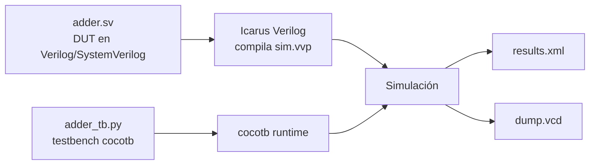

# Curso de validación FPGA con cocotb

Esta carpeta contiene notas en formato Markdown pensadas para Obsidian. La idea es explicar los conceptos de `part_02` del curso y dejar enlaces entre temas para estudiar o preparar una clase.

## Recorrido sugerido

1. [[01_entorno_de_simulacion|Entorno de simulación]]
2. [[02_estructura_de_un_test_cocotb|Estructura de un test cocotb]]
3. [[03_dut_senales_y_jerarquia|DUT, señales y jerarquía]]
4. [[04_tiempo_triggers_y_reloj|Tiempo, triggers y reloj]]
5. [[05_estimulos_y_randomizacion|Estímulos y randomización]]
6. [[06_logs_asserts_y_scoreboard|Logs, asserts y scoreboard]]
7. [[07_representacion_binaria|Representación binaria]]
8. [[08_concurrencia_en_cocotb|Concurrencia en cocotb]]
9. [[09_bloques_digitales_validados|Bloques digitales validados]]
10. [[10_debug_waveforms_y_vcd|Debug con waveforms y VCD]]
11. [[11_mapa_de_ejercicios|Mapa de ejercicios]]
12. [[12_glosario|Glosario]]

## Idea central

cocotb permite escribir testbenches en Python para verificar módulos HDL. En este curso se usa Icarus Verilog como simulador y Makefiles simples para compilar `adder.sv`, cargar `adder_tb.py` y ejecutar cada ejercicio con:

```sh
make clean
make icarus=sim
```

## Relación entre archivos


