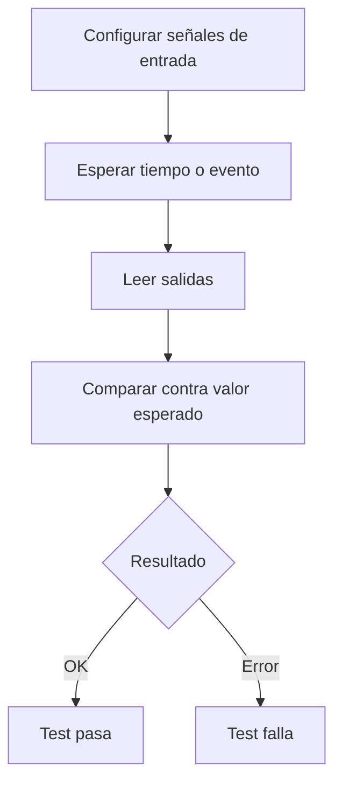

# Estructura de un test cocotb

Un test cocotb es una función Python asincrónica decorada con `@cocotb.test()`.

```python
@cocotb.test()
async def test(dut):
    dut.a.value = 3
    dut.b.value = 5
    await Timer(10, units="ns")
    assert dut.s.value == 8
```

## Partes principales

- `dut`: referencia al módulo HDL que se está simulando.
- `dut.a.value`: acceso a una señal del DUT.
- `await Timer(...)`: avance del tiempo de simulación.
- `assert`: chequeo de comportamiento esperado.

## Flujo básico



## Async y await

cocotb usa corrutinas porque la simulación avanza por eventos. `await` indica que el test espera a que ocurra algo:

- un tiempo fijo: `Timer(10, "ns")`
- un flanco: `RisingEdge(dut.clk)`
- varios ciclos: `ClockCycles(dut.clk, 5)`

Ver [[04_tiempo_triggers_y_reloj|Tiempo, triggers y reloj]].
