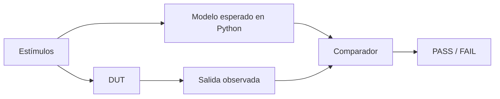

# Logs, asserts y scoreboard

La verificación no termina en aplicar estímulos. También hay que observar, comparar y reportar.

## Logging

Python permite imprimir mensajes con niveles:

```python
logging.info("Valor de salida: %s", dut.dout.value)
logging.warning("Evento importante")
logging.error("Fallo detectado")
```

En cocotb, los logs aparecen con tiempo de simulación, lo que ayuda a correlacionar mensajes con waveforms.

## Assert

`assert` marca el test como fallido si una condición no se cumple:

```python
assert dut.s.value == a + b
```

Es la forma más directa de convertir una expectativa en verificación automática.

## Contadores de error

Algunos ejercicios acumulan errores:

```python
error_count = 0
if dut.dout.value != esperado:
    error_count += 1
```

Esto permite terminar una tanda de pruebas y reportar cuántas fallaron.

## Scoreboard conceptual

Un scoreboard compara:

- valor esperado calculado por el testbench
- valor observado en el DUT



En el ejercicio de memoria, el diccionario Python cumple el rol de modelo esperado.
