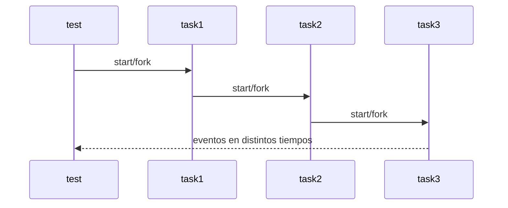

# Concurrencia en cocotb

La simulación digital tiene muchas cosas ocurriendo al mismo tiempo: clocks, resets, estímulos, monitores y chequeos. cocotb modela eso con corrutinas concurrentes.

## start_soon

`cocotb.start_soon()` arranca una corrutina y permite que el test continúe:

```python
cocotb.start_soon(rst_stimuli(dut))
cocotb.start_soon(Clock(dut.clk, 20, "ns").start())
await Timer(200, "ns")
```

Esto es ideal para procesos que deben correr en paralelo.

## fork y start

El curso también muestra APIs legacy:

- `cocotb.fork(...)`
- `await cocotb.start(...)`
- `@cocotb.coroutine`

Estas APIs son históricas de cocotb 1.x. Por eso el entorno usa `cocotb==1.9.2`.

## Diferencia conceptual

- `start_soon`: lanza una tarea y sigue.
- `await cocotb.start`: lanza una tarea y espera su arranque.
- `fork`: forma vieja de lanzar tareas concurrentes.

## Casos del curso

En las secciones de concurrencia se usan tareas `task1`, `task2`, `task3` para observar el orden de ejecución según delays y forks.


